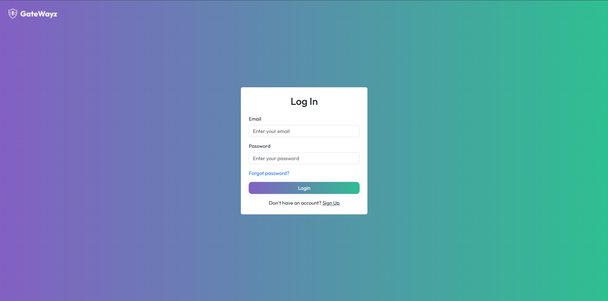
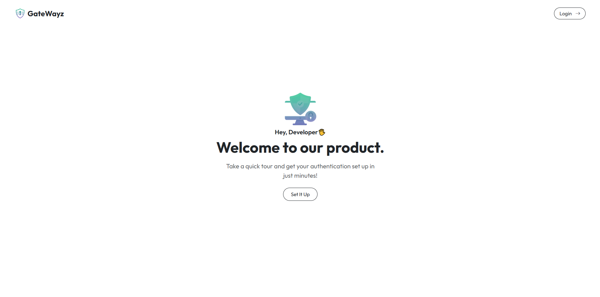

# 🔐 Frontend - Sistema de Autenticação | Authentication System

**🇧🇷 Português** | **🇺🇸 English**

---

## 📘 Descrição | Description

**🇧🇷**
Este projeto é o frontend de um sistema de autenticação completo, com funcionalidades de registro e login de usuários. Além disso, o sistema permite:

- Verificação de e-mail com código OTP de 6 dígitos.
- Confirmação de conta via e-mail.
- Recuperação de senha ("Esqueci minha senha") com envio de código OTP para redefinição.

Foi desenvolvido em React, utilizando React Router, Axios e Bootstrap, e se comunica com uma API backend para validação de credenciais, verificação de identidade e controle de acesso.

**🇺🇸**
This project is the frontend of a complete authentication system, featuring user registration and login. The system also includes:

- Email verification with a 6-digit OTP code.
- Account confirmation via email.
- Password recovery ("Forgot password") with OTP sent to reset the password.

It was built using React, React Router, Axios, and Bootstrap, and communicates with a backend API for credential validation, identity verification, and access control.

---

## 🖼️ Imagens do Sistema | System Screenshots

  


---

## 🧰 Tecnologias | Technologies

- React
- React Router DOM
- Axios
- Bootstrap
- HTML5 & CSS3

---

## 🚀 Como Executar | How to Run

**🇧🇷**

```bash
git clone https://github.com/seu-usuario/seu-projeto.git
cd seu-projeto
npm install
npm run dev
```

O aplicativo estará disponível em `http://localhost:5173`.

**🇺🇸**

```bash
git clone https://github.com/your-user/your-project.git
cd your-project
npm install
npm run dev
```

The app will be available at `http://localhost:5173`.

---

## 📂 Estrutura do Projeto | Project Structure

```
src/
├── components/
├── context/
├── pages/
├── styles/
├── util/
├── App.jsx
├── main.jsx
```

---

## 🔗 Backend

**🇧🇷**
Este frontend consome uma API Spring Boot localizada em `http://localhost:8080/api/v1`.

🔗 Veja o repositório do backend aqui:
[→ Backend - Spring Boot](https://github.com/luiz-matoso/gatewayz-backend)

**🇺🇸**
This frontend consumes a Spring Boot API available at `http://localhost:8080/api/v1`.

🔗 Check the backend repository here:
[→ Backend - Spring Boot](https://github.com/luiz-matoso/gatewayz-backend)

---

## 📄 Licença | License

MIT License

---
